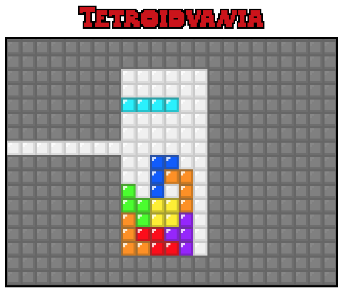

# Tetroidvania

This is my [contribution](http://ludumdare.com/compo/ludum-dare-35/?action=preview&uid=46246) for [Ludum Dare edition #35](http://ludumdare.com/compo/2016/04/13/welcome-to-ludum-dare-35/). I participated in the Compo, in which solo devs have 48 hours to make a game based on a theme. For this edition the theme was "shapeshift", so I made a game about a tetromino who collects abilities, including the ability to transform into other tetromino shapes.

Play it [here](http://gelisam.com/ludum-dare-35-postcompo/)!
